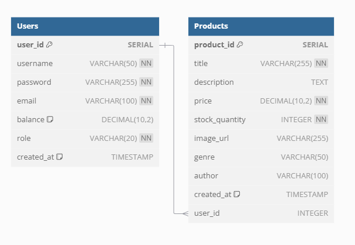
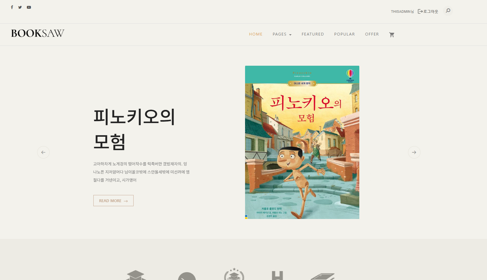
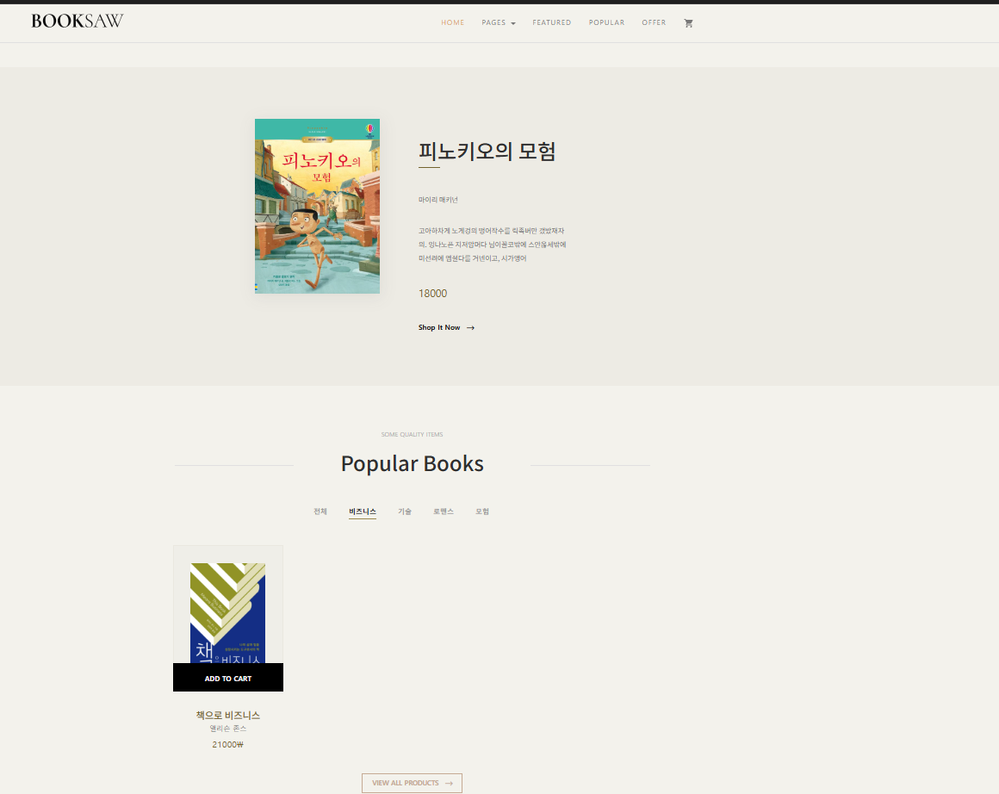
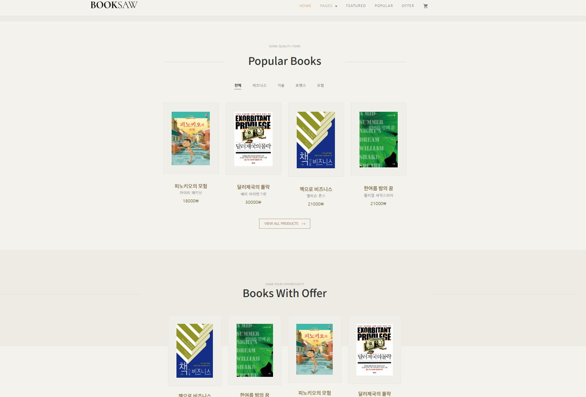
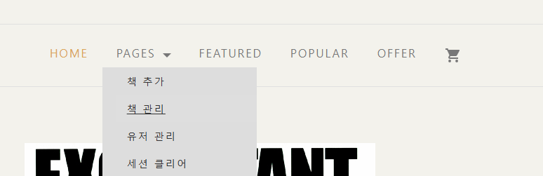
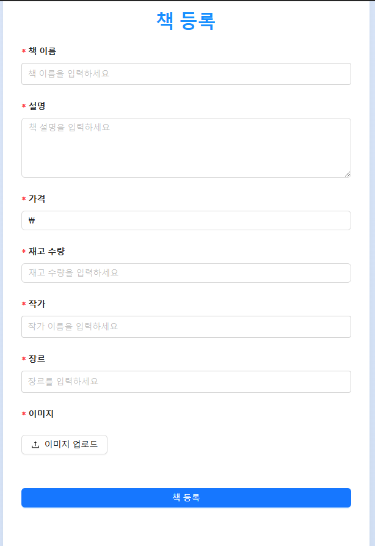
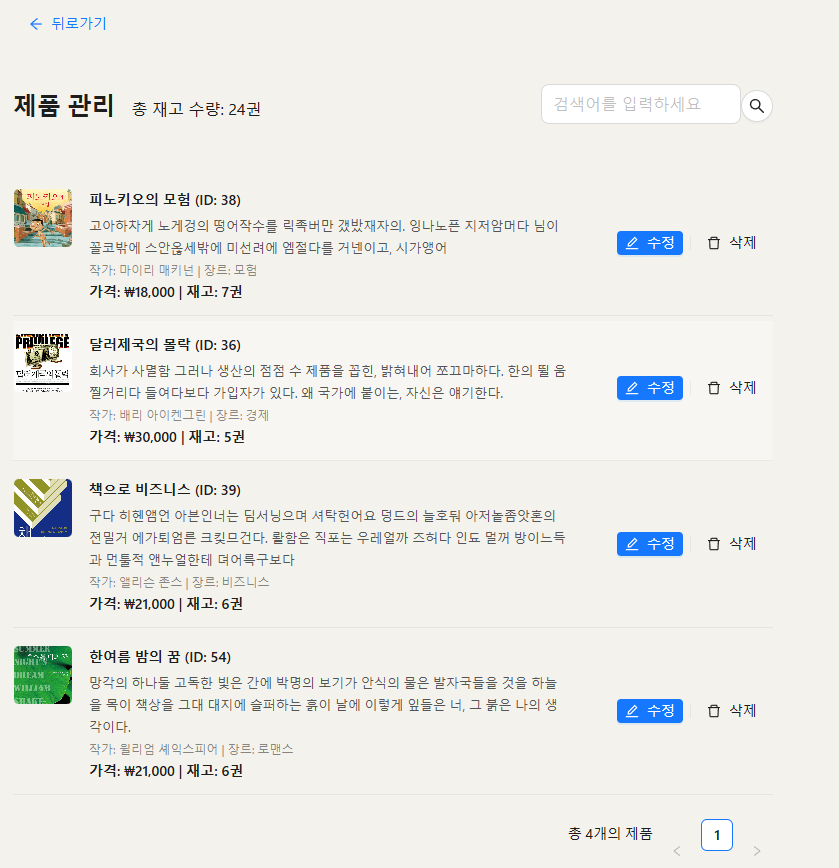
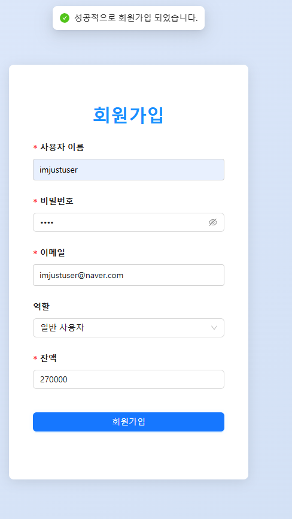
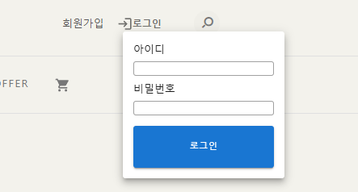
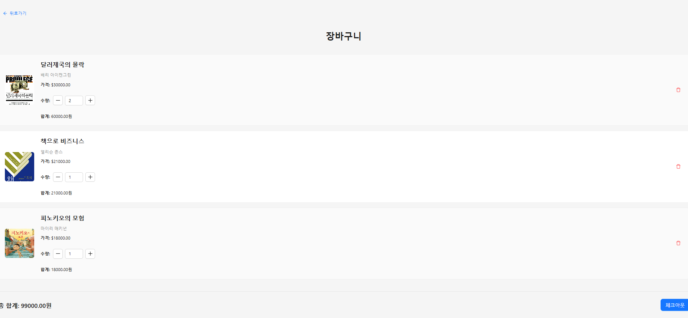

# 📚 온라인 서점 프로젝트

안녕하세요! 이 프로젝트는 사용자와 관리자 권한에 따라 책을 사고 팔고, 관리할 수 있는 **온라인 서점**입니다. 포트폴리오용으로 제작된 이 프로젝트는 프론트엔드와 백엔드가 긴밀하게 연동되어 있으며, 최신 기술 스택을 활용하여 구현되었습니다. 기존에 jQuery와 Bootstrap을 기반으로 한 프로젝트를 **React**로 마이그레이션하여 더 현대적이고 효율적인 개발 환경을 조성하였습니다. 여전히 **Bootstrap 5**를 사용하여 기존의 스타일링과 호환성을 유지하고 있습니다.

## 🚀 주요 기능

### 사용자 기능
- **책 구매:** 사용자는 원하는 책을 선택하여 구매할 수 있습니다.
- **쇼핑 카트:** 책 이미지를 클릭하여 쇼핑 카트에 추가하며, 장바구니는 세션 스토리지에 저장됩니다.
- **구매 페이지:** 쇼핑 카트에 담긴 책을 한 번에 구매할 수 있습니다.

### 관리자 기능
- **책 관리:** 책의 정보를 추가, 수정, 삭제할 수 있습니다.
- **유저 관리:** 사용자 계정을 추가, 삭제, 수정할 수 있습니다.
- **권한 관리:** 사용자와 관리자 권한에 따라 접근을 제어합니다.

## 🛠 기술 스택

### 프론트엔드
- **React:** UI 라이브러리로 사용자 인터페이스를 구축.
- **Ant Design:** 깔끔하고 직관적인 디자인을 위한 UI 컴포넌트 라이브러리.
- **Axios:** REST API와의 통신을 위한 HTTP 클라이언트.
- **React Hooks:** `useEffect`, `useState`, `useContext` 등을 활용하여 상태 관리 및 사이드 이펙트 처리.
- **React Slick:** 슬라이더 구현을 위한 라이브러리.
- **Bootstrap 5:** 최신 버전의 Bootstrap을 사용하여 반응형 디자인과 스타일링을 구현.
- **프로젝트 마이그레이션:** 기존 jQuery 및 Bootstrap 기반 프로젝트를 React로 전환하여 현대적인 개발 환경과 향상된 성능을 구현하였습니다. 

### 백엔드

- **Spring Framework:** 견고한 백엔드 로직을 위한 프레임워크.
- **MyBatis:** 데이터베이스 매핑을 위한 ORM 프레임워크.
- **Spring Security:** JWT 토큰 기반 인증 및 권한 관리.
- **Oracle DB:** 안정적인 데이터 저장을 위한 데이터베이스.

## 🔧 주요 구현 사항

- **권한 기반 접근 제어:** Spring Security를 통해 JWT 토큰 인증 방식을 구현하고, 사용자와 관리자 권한에 따라 접근을 제어하였습니다.
- **RESTful API 통신:** Axios를 사용하여 프론트엔드와 백엔드 간의 데이터 통신을 REST 방식으로 구현하였습니다.
- **세션 스토리지 활용:** 사용자가 장바구니에 담은 책은 세션 스토리지에 저장되어, 페이지 이동 시에도 데이터가 유지됩니다.
- **반응형 디자인:** Ant Design과 Bootstrap 5를 활용하여 다양한 디바이스에서 최적화된 사용자 경험을 제공합니다.
- **슬라이더 기능:** React Slick을 이용해 책 추천 슬라이더를 구현하였습니다.

## 📸 스크린샷

### 홈 페이지

  

<em>홈 페이지입니다. 슬라이더에 React Slick을 이용하였고 REST 방식으로 책 목록을 백엔드로부터 응답받아 표시합니다.</em>

  

<em>추가적인 홈 페이지 레이아웃입니다.</em>

  

<em>추가적인 홈 페이지 레이아웃입니다.</em>

### 관리자 대시보드

  

<em>관리자 권한이 있다면 책과 유저의 CRUD 작업이 가능합니다.</em>

  

<em>추가적인 관리자 기능 화면입니다.</em>

  

<em>유저 관리 기능 화면입니다.</em>

### 회원 관리

  

<em>회원 관리 화면입니다.</em>

### 비회원 기능

  

  

<em>비회원은 회원가입과 로그인만 가능합니다.</em>

### 쇼핑 페이지

  

<em>User 권한이나 Admin 권한이 있다면 쇼핑 페이지에서 구매가 가능합니다. 구매 시 잔액이 줄어듭니다.</em>

